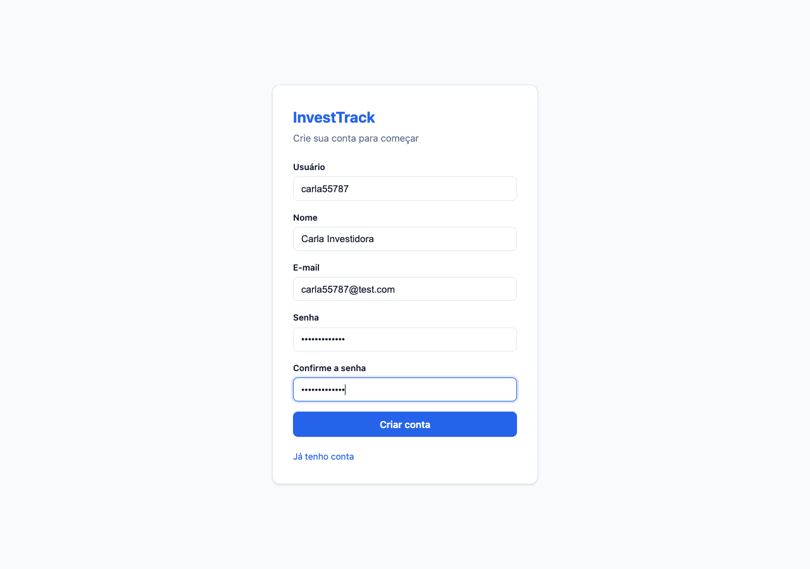
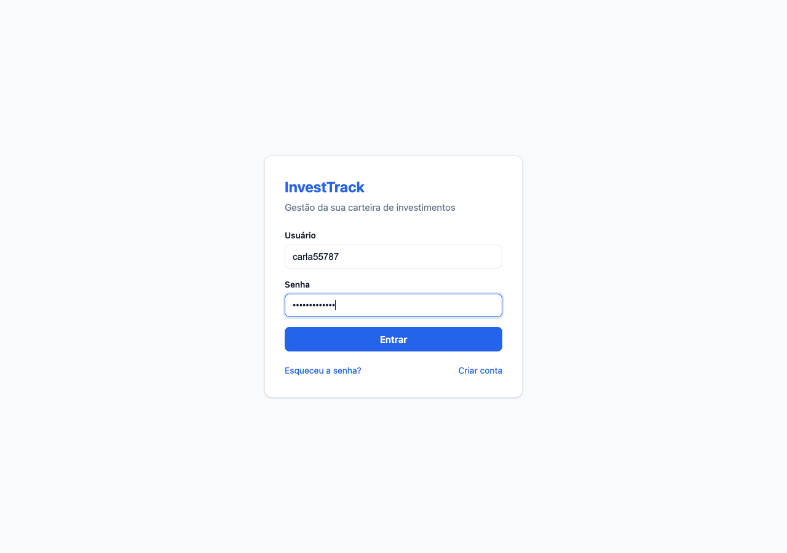
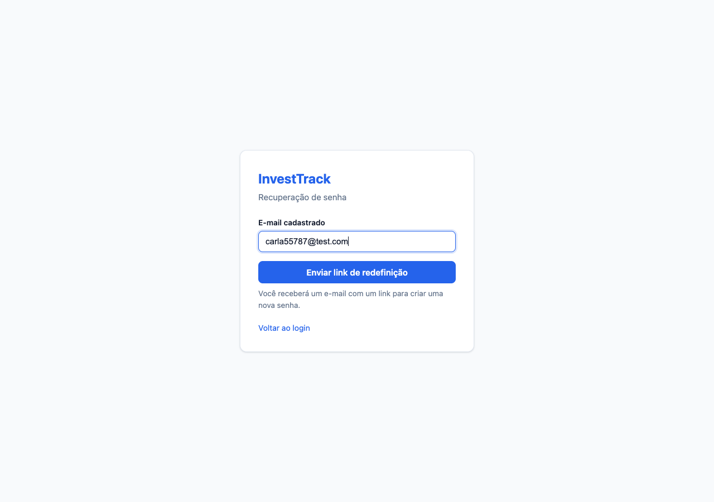
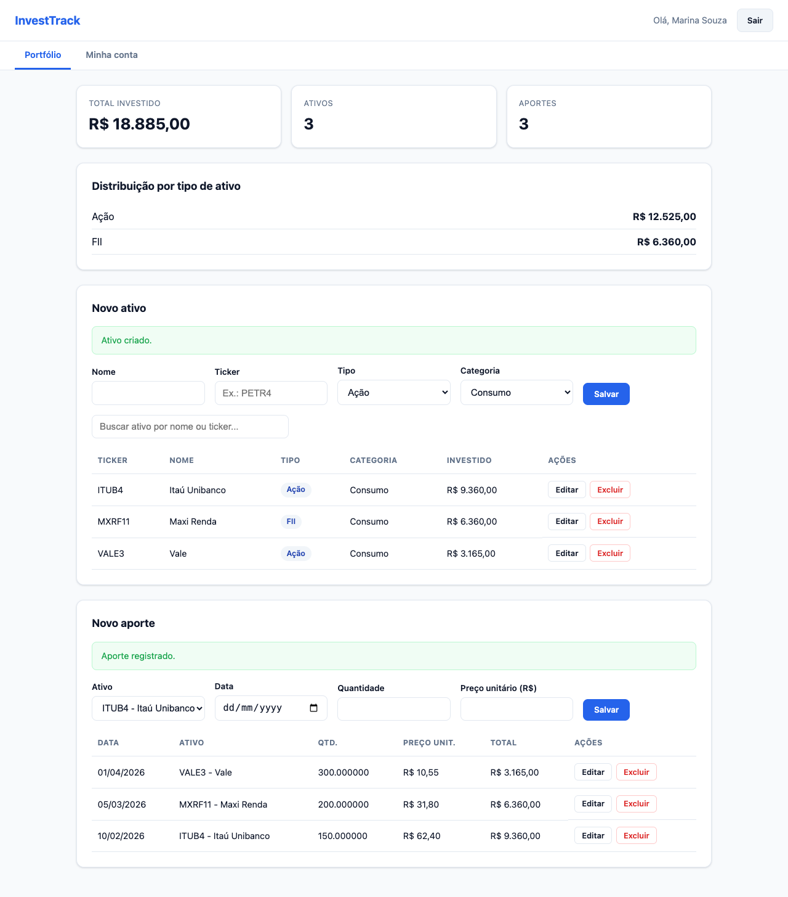
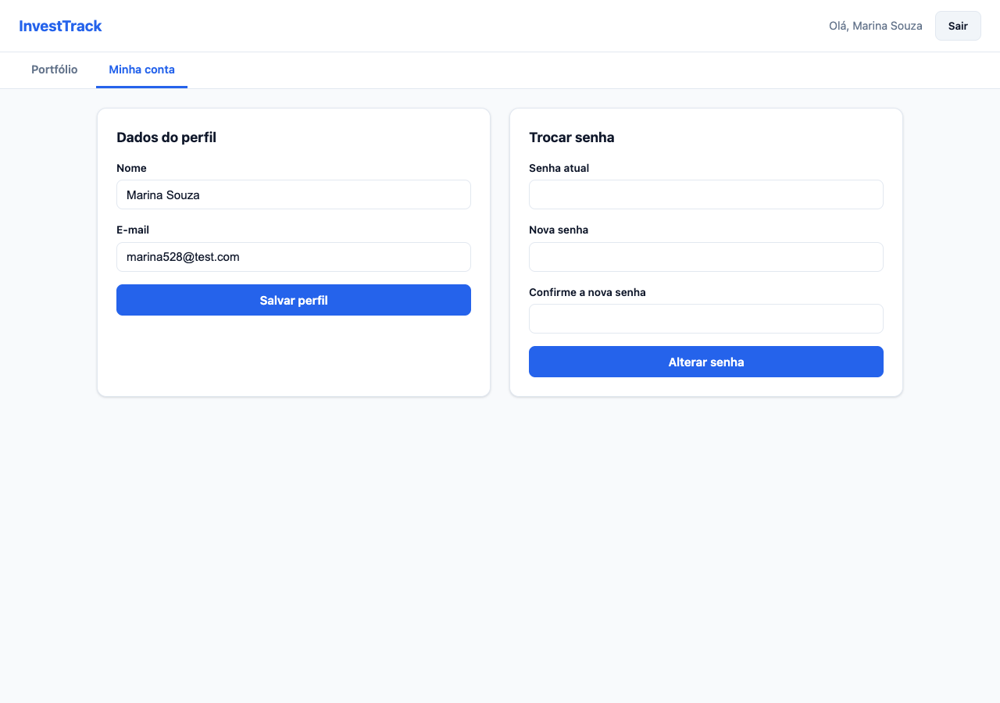

# InvestTrack Web — Frontend

Frontend da plataforma InvestTrack de gestão de portfólios de investimentos.
Front do 2º Trabalho de Programação para Web (INF1407, PUC-Rio, 2026/1).

Site feito somente com HTML, CSS e JavaScript, sendo que todo o código JavaScript
foi escrito em TypeScript e compilado para JS pelo Vite. Consome a
[InvestTrack API](#backend), que está em um repositório separado, em Django/DRF.

## Integrantes do grupo

- Luis Felipe Gadelha — 2210308

---

## Escopo (o que foi desenvolvido)

Aplicação web multipágina onde cada usuário gerencia a própria carteira:

- Login com JWT e cadastro de novo usuário.
- Gerência de senha: troca de senha (já logado) e recuperação de senha
  (esqueci minha senha, e-mail, redefinir).
- Visões por usuário: cada um só vê e edita os próprios ativos e aportes. A
  sessão é mantida pelo token e renovada automaticamente.
- CRUD completo (as quatro operações) sobre dois recursos:
  - Ativos: criar, listar/buscar, editar e excluir.
  - Aportes: criar, listar, editar e excluir.
- Dashboard com resumo do portfólio: total investido, número de ativos e aportes,
  e distribuição por tipo de ativo.

---

## Telas

| Cadastro | Login | Esqueci a senha |
|----------|-------|-----------------|
|  |  |  |

| Dashboard / Portfólio (CRUD) | Minha conta (perfil + senha) |
|------------------------------|------------------------------|
|  |  |

---

## Tecnologias

- TypeScript (todo o JavaScript do site)
- Vite (dev server e build)
- HTML5 e CSS3 (sem frameworks de UI)
- Nginx (para servir os estáticos em container)
- Docker

---

## Estrutura

```
frontend/
├── index.html              # Login
├── register.html           # Cadastro
├── forgot-password.html    # Solicita redefinição de senha
├── reset-password.html     # Define nova senha (link do e-mail)
├── app.html                # Dashboard: CRUD de ativos e aportes + conta
├── src/
│   ├── api.ts              # Cliente HTTP da API (JWT + refresh automático)
│   ├── auth.ts             # Tokens no localStorage e guardas de rota
│   ├── types.ts            # Tipos que espelham a API
│   ├── ui.ts               # Utilitários de interface (moeda, datas, mensagens)
│   ├── login.ts / register.ts / forgot.ts / reset.ts
│   └── app.ts              # Lógica do dashboard (CRUD)
└── styles/main.css
```

---

## Instalação e uso local

Precisa de Node.js 18+ e da [InvestTrack API](#backend) rodando (por padrão em
`http://localhost:8000`).

```bash
git clone https://github.com/lipegvgad/investtrack-frontend.git
cd investtrack-frontend

npm install
npm run dev
```

A aplicação abre em http://localhost:5173.

Se a API estiver em outro endereço, copie `.env.example` para `.env` e ajuste
`VITE_API_URL` (por exemplo, `VITE_API_URL=https://sua-api.com/api`).

### Build de produção

```bash
npm run build      # gera a pasta dist/ (HTML + CSS + JS compilado do TS)
npm run preview    # serve o build localmente para conferência
```

### Fluxo de uso

1. Acesse "Criar conta" e cadastre-se.
2. Faça login.
3. Em Portfólio, cadastre seus ativos (ação, FII, etc.).
4. Registre aportes para cada ativo. O total e a distribuição se atualizam.
5. Edite ou exclua ativos e aportes pelos botões da tabela.
6. Em Minha conta, atualize o perfil ou troque a senha.
7. Esqueceu a senha? Use "Esqueceu a senha?" na tela de login.

---

## Execução com Docker

### Usando a imagem publicada no Docker Hub

A imagem do frontend é compilada apontando para a API em
`http://localhost:8000/api`. Por isso, suba os dois containers (API e Web) na
mesma máquina, com a API na porta 8000:

```bash
# 1) Backend (API) na porta 8000
docker pull lipegvgad/investtrack-api:latest
docker run -d -p 8000:8000 -e SECRET_KEY=alguma-chave lipegvgad/investtrack-api:latest

# 2) Frontend (Web) na porta 8080
docker pull lipegvgad/investtrack-web:latest
docker run -d -p 8080:80 lipegvgad/investtrack-web:latest
```

Acesse http://localhost:8080 (o navegador conversa com a API em
`http://localhost:8000`).

### Build local da imagem

```bash
# build (informe a URL da API; padrão: http://localhost:8000/api)
docker build --build-arg VITE_API_URL=http://localhost:8000/api -t investtrack-web .
docker run -p 8080:80 investtrack-web
```

Para apontar para uma API hospedada (URL pública), refaça o build com
`--build-arg VITE_API_URL=https://sua-api.com/api`.

---

## Publicação

- Repositório (frontend): https://github.com/lipegvgad/investtrack-frontend
- Imagem publicada (Docker Hub): https://hub.docker.com/r/lipegvgad/investtrack-web

<a name="backend"></a>
- Repositório (backend / API): https://github.com/lipegvgad/investtrack-backend
- Imagem do backend (Docker Hub): https://hub.docker.com/r/lipegvgad/investtrack-api

As duas imagens são multi-arquitetura (`linux/amd64` e `linux/arm64`). Veja na
seção [Execução com Docker](#execução-com-docker) como subir os dois containers.

---

## O que funcionou (testado)

- Cadastro, login (JWT) e logout.
- CRUD completo de ativos e aportes pela interface, com atualização do resumo.
- Busca de ativos por nome/ticker.
- Isolamento por usuário: cada conta enxerga apenas a própria carteira.
- Troca de senha e recuperação de senha (esqueci, e-mail, redefinir).
- Renovação automática do token de acesso quando ele expira.
- Build TypeScript sem erros (`npm run build`) e execução em container Nginx.
- Fluxo completo testado em navegador (cadastro, login, CRUD, conta), sem erros
  de página ou de requisição.

## O que não funcionou / limitações conhecidas

- Não há gráfico visual (apenas a lista de distribuição por tipo). O resumo é
  textual/numérico.
- O recebimento real do e-mail de redefinição depende da configuração SMTP no
  backend. Sem ela, o link aparece no console do servidor da API.
- A sessão é mantida no `localStorage`. Não há "lembrar-me" configurável nem
  logout automático por inatividade.
